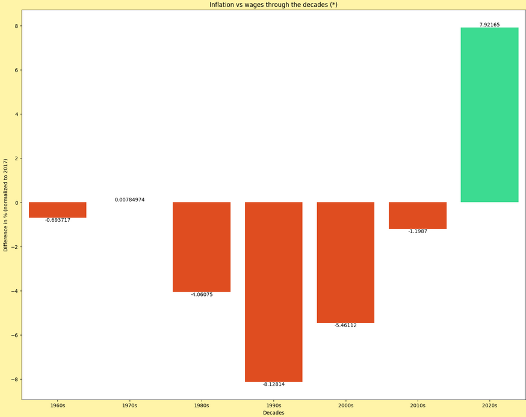
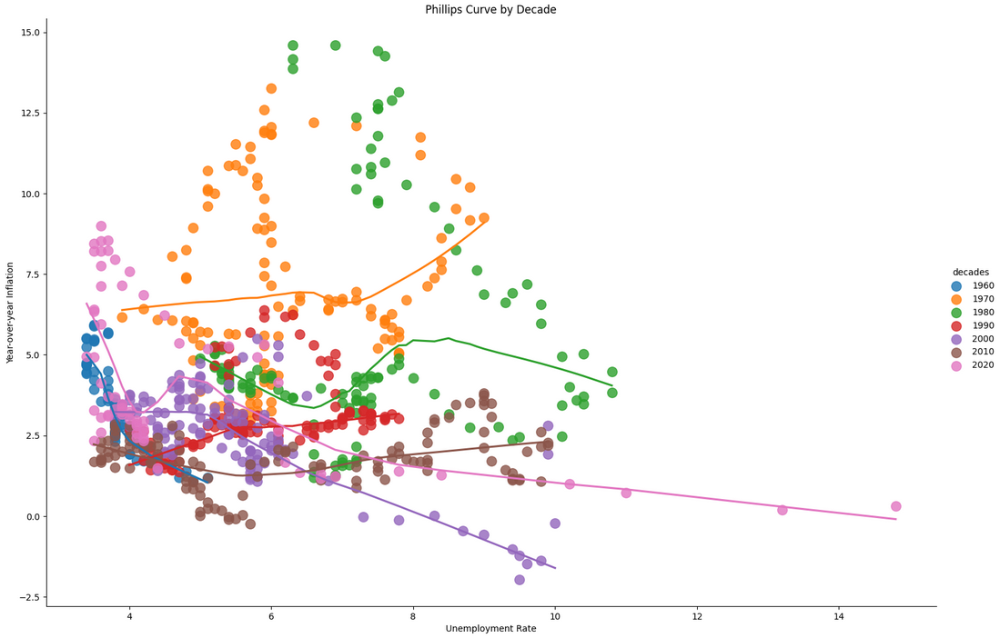

<h1 align="center"><b>Analiza Danych Makroekonomicznych USA (1960-2025)</b></h1>
  
---

### **Wersja Polska**

#### **Cel Projektu**
Stworzyłem ten projekt, aby rozwinąć swoje umiejętności związane z analizą i wizualizacją danych. Pracowałem na rzeczywistych, historycznych danych makroekonomicznych pochodzących z **FRED (Federal Reserve Economic Data)**, obejmujących okres od lat 60. XX wieku do czasów współczesnych.

<strong>Jupyter Notebook z pełną analizą: </strong>
  

#### **Główne Pytania Analityczne**
Projekt koncentruje się na odpowiedzi na następujące pytania:
- Jakie są korelacje między inflacją, płacami, bezrobociem i stopami procentowymi?
- Czy wzrost płac nadążał za inflacją na przestrzeni ostatnich dekad?
- Czy klasyczna teoria ekonomiczna Krzywej Phillipsa (odwrotna zależność między inflacją a bezrobociem) jest widoczna w danych?

#### **Użyte Technologie**
- **Środowisko analityczne:** Jupyter Notebook
- **Język programowania:** Python 3.10+
- **Analiza danych:** Pandas
- **Wizualizacje:** Matplotlib / Seaborn

#### **Najważniejsze Wnioski**

1.  **Odwrócenie trendu płacowego:** Analiza dekadowa wykazała, że lata 2020. są pierwszym okresem od ponad 60 lat, w którym średni wzrost płac (znormalizowany do 2017 r.) przewyższył średnią inflację.
    
    
    
2.  **Niestabilność Krzywej Phillipsa:** Zależność między inflacją a bezrobociem okazała się niestabilna. Była wyraźnie widoczna w latach 60., jednak w innych dekadach (np. w latach 70., okresie stagflacji) była słaba lub nie istniała. Dowodzi to, że jej występowanie zależy od szerszego kontekstu ekonomicznego.

    
---
 

### **English Version**

#### **Project Goal**
I created this project to develop my data analysis and data engineering skills by working with real macroeconomic datasets from **FRED (Federal Reserve Economic Data)**, covering the period from the 1960s to the present day.

<strong>The Jupyter Notebook with the data analysis: </strong>
  

#### **Main Analytical Questions**
The project focuses on answering the following questions:
- What are the correlations between inflation, wages, unemployment, and interest rates?
- Has wage growth kept pace with inflation across the decades?
- Is the classic Phillips Curve economic theory (an inverse relationship between inflation and unemployment) visible in the data?

#### **Technologies Used**
- **Analytical Environment:** Jupyter Notebook
- **Programming Language:** Python 3.10+
- **Data Analysis:** Pandas
- **Data Visualization:** Matplotlib / Seaborn

#### **Key Findings**

1.  **Reversal of the Wage Trend:** A decadal analysis showed that the 2020s are the first period in over 60 years where average wage growth (normalized to 2017) has outpaced average inflation.
    
    
    
2.  **Instability of the Phillips Curve:** The relationship between inflation and unemployment proved to be unstable. While clearly visible in the 1960s, it was weak or non-existent in other decades (e.g., during the "stagflation" of the 1970s). This suggests its validity depends on the broader economic context.

    

